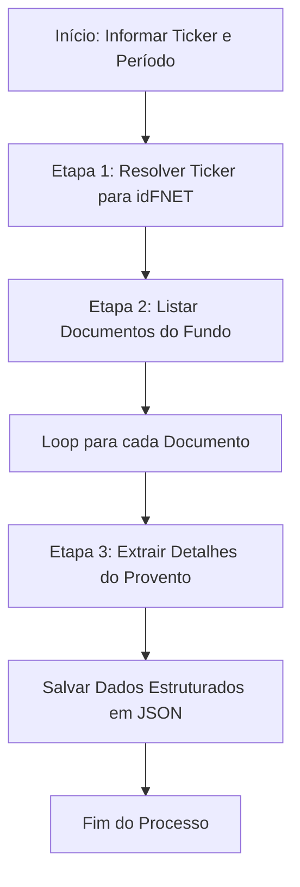

# RFC-001 - Rendimentos e Amortizações (Estruturado)

---

## 1. Objetivo da Funcionalidade

Extrair, processar e armazenar informações estruturadas sobre pagamentos de proventos (rendimentos e amortizações) de um fundo imobiliario listado na B3. A funcionalidade deve ser capaz de, a partir do ticker do fundo, obter seu identificador interno e, em seguida, extrair os dados detalhados do documento oficial de proventos, que está disponível em formato **HTML tabular**.

## 2. Arquitetura Geral

A funcionalidade seguirá um fluxo de trabalho em três etapas principais:

1. **Resolução do Fundo:** Converter o ticker (ex: `ALZR11`) no identificador interno do fundo (`idFNET`).
2. **Listagem de Documentos:** Obter a lista de documentos (relatórios estruturados) disponíveis para o fundo em um período específico.
3. **Extração Detalhada:** Para cada documento, acessar a URL detalhada e extrair todas as informações estruturadas do provento a partir do HTML tabular.



## 3. Descrição Detalhada das Etapas

### 3.1. Etapa 1: Resolução do Ticker para `idFNET`

**Endpoint:**

```
GET https://sistemaswebb3-listados.b3.com.br/fundsListedProxy/Search/GetListClassFund/{token}
```

**Construção do Token:**
O token é uma string Base64 codificada a partir de um objeto JSON com os seguintes parâmetros:

| Parâmetro   | Descrição                               | Valor (Exemplo) | Obrigatório |
| :---------- | :-------------------------------------- | :-------------- | :---------- |
| `linguagem` | Idioma da resposta                      | `"pt-br"`       | Sim         |
| `idCEM`     | **Ticker** do fundo (sem o sufixo "11") | `"ALZR"`        | Sim         |
| `typeFund`  | Tipo do fundo                           | `"FII"`         | Sim         |

**Exemplo de Geração do Token (Python):**

```python
import json
import base64

payload = {
    "linguagem": "pt-br",
    "idCEM": "ALZR",
    "typeFund": "FII"
}
token = base64.b64encode(json.dumps(payload).encode()).decode()
# Resultado: eyJsYW5ndWFnZSI6InB0LWJyIiwiaWRDRU0iOiJBTFpSIiwidHlwZUZ1bmQiOiJGSUkifQ==
```

**Processamento da Resposta:**
A resposta é um array JSON com objetos representando o fundo. Para encontrar o `idFNET`:

1. Parsear o array JSON.
2. Iterar sobre os objetos.
3. Selecionar o objeto onde o campo `tradingName` **NÃO** contém a substring `"Fundo:"`.
4. O valor do campo `id` deste objeto é o `idFNET` desejado.

**Exemplo de Resposta e Extração:**

```json
// Resposta da API
[
  { "id": "870", "tradingName": "Fundo: 28.737.771/0001-85" },
  { "id": "20294", "tradingName": "28.737.771/0001-85" } // <-- idFNET = "20294"
]
```

### 3.2. Etapa 2: Listagem de Documentos do Fundo

**Endpoint:**

```
GET https://sistemaswebb3-listados.b3.com.br/fundsListedProxy/Search/GetStructuredReports/{token}
```

**Construção do Token:**
Token Base64 gerado a partir do seguinte JSON:

| Parâmetro     | Descrição                                        | Valor (Exemplo) | Obrigatório |
| :------------ | :----------------------------------------------- | :-------------- | :---------- |
| `linguagem`   | Idioma da resposta                               | `"pt-br"`       | Sim         |
| `dataInicial` | Data de início da busca                          | `"2026-01-01"`  | Sim         |
| `dataFinal`   | Data de fim da busca                             | `"2026-07-29"`  | Sim         |
| `pageNumber`  | Número da página                                 | `1`             | Sim         |
| `pageSize`    | Itens por página (máx. 20)                       | `20`            | Sim         |
| **`idFNET`**  | **Identificador obtido na Etapa 1**              | `"20294"`       | Sim         |
| `typeFund`    | Tipo do fundo                                    | `"FII"`         | Sim         |
| `type`        | Tipo de relatório (41 = Rendimentos Estruturado) | `41`            | Sim         |

**Exemplo de Geração do Token:**

```python
payload = {
    "linguagem": "pt-br",
    "dataInicial": "2026-01-01",
    "dataFinal": "2026-07-29",
    "pageNumber": 1,
    "pageSize": 20,
    "idFNET": "20294",
    "typeFund": "FII",
    "type": 41
}
token = base64.b64encode(json.dumps(payload).encode()).decode()
```

**Processamento da Resposta:**
A resposta é um objeto JSON com:

- **`page`:** Metadados de paginação (`totalPages`, `totalRecords`).
- **`results`:** Lista de documentos.

| Campo                 | Descrição                      | Uso                         |
| :-------------------- | :----------------------------- | :-------------------------- |
| `urlViewerFundosNet`  | URL para o documento detalhado | Contém o `id` do documento. |
| `referenceDate`       | Data de referência do provento | Metadado                    |
| `referenceDateFormat` | Data de referência formatada   | Metadado                    |
| `deliveryDateFormat`  | Data de entrega do documento   | Metadado                    |

**Tratamento de Paginação:**
A funcionalidade deve:

1. Extrair `page.totalPages`.
2. Se `totalPages > 1`, iterar, alterando o `pageNumber` no token e repetindo a requisição para obter todas as páginas.
3. Consolidar todos os `results` de todas as páginas em uma única lista.

### 3.3. Etapa 3: Extração Detalhada dos Dados do Provento (HTML Tabular)

#### 3.3.1. Acesso à Página

A página acessada via `urlViewerFundosNet` (ex: `https://fnet.bmfbovespa.com.br/fnet/publico/exibirDocumento?id=1224160`) contém os dados do provento em formato **HTML tabular**.

#### 3.3.2. Estrutura da Página

A página apresenta dados organizados em tabelas HTML (`<table>`), com informações agrupadas em:

- **Cabeçalho do Fundo:** Nome, CNPJ, administrador, contato.
- **Detalhes do Provento:** ISIN, ticker, tipo, datas, valor, período de referência.
- **Notas de Rodapé:** Informações sobre isenção fiscal.

#### 3.3.3. Estratégia de Extração Flexível

**Passo 1: Obter o HTML da Página**

```python
import requests
from bs4 import BeautifulSoup

url = "https://fnet.bmfbovespa.com.br/fnet/publico/exibirDocumento?id=1224160"
response = requests.get(url)
soup = BeautifulSoup(response.content, 'html.parser')
```

**Passo 2: Identificar e Parsear Tabelas**
O conteúdo tabular está em tabelas HTML. A extração deve ser flexível para lidar com variações na estrutura.

```python
def extrair_tabelas(soup):
    """Extrai todas as tabelas da página e as converte em dicionários"""
    tables_data = []
    for table in soup.find_all('table'):
        table_info = {
            'contexto': identificar_contexto_tabela(soup, table),
            'dados': extrair_dados_tabela(table)
        }
        tables_data.append(table_info)
    return tables_data

def extrair_dados_tabela(table):
    """Extrai dados de uma tabela HTML para uma lista de dicionários"""
    dados = []

    # Extrair cabeçalhos
    headers = []
    thead = table.find('thead')
    if thead:
        headers = [th.get_text(strip=True) for th in thead.find_all('th')]

    # Extrair linhas
    tbody = table.find('tbody') or table
    for row in tbody.find_all('tr'):
        cols = row.find_all('td')
        if not headers and cols:
            # Usar a primeira linha como cabeçalho se não houver thead
            headers = [col.get_text(strip=True) for col in cols]
            continue

        row_data = {}
        for idx, col in enumerate(cols):
            if idx < len(headers):
                row_data[headers[idx]] = col.get_text(strip=True)
        if row_data:
            dados.append(row_data)

    return dados

def identificar_contexto_tabela(soup, table):
    """Identifica o contexto da tabela baseado em elementos próximos"""
    # Procura por um cabeçalho (<h2>, <h3>) ou texto em negrito antes da tabela
    previous = table.find_previous(['h2', 'h3', 'h4', 'strong', 'b'])
    if previous:
        return previous.get_text(strip=True)

    # Fallback: usar o texto do caption, se existir
    caption = table.find('caption')
    if caption:
        return caption.get_text(strip=True)

    return "Informações Gerais"
```

**Passo 3: Extração por Rótulo (Busca Flexível)**
Além das tabelas, alguns dados podem estar fora delas. Para maior robustez, utilize busca por rótulos:

```python
def extrair_por_rotulo(soup, rotulo):
    """Extrai o valor associado a um rótulo na página"""
    # Busca o rótulo e captura o próximo elemento ou o valor no mesmo elemento
    elementos = soup.find_all(string=lambda text: rotulo in text if text else False)
    for elem in elementos:
        # Se o rótulo está em um elemento, o valor pode estar no próximo sibling
        parent = elem.parent
        if parent:
            # Tenta encontrar o valor no próximo elemento irmão
            next_sibling = parent.find_next_sibling()
            if next_sibling:
                return next_sibling.get_text(strip=True)
            # Ou no mesmo elemento, após os dois pontos
            if ':' in elem:
                return elem.split(':', 1)[1].strip()
    return None
```

#### 3.3.4. Mapeamento de Dados para JSON

Com base nas tabelas extraídas e na busca por rótulos, os dados são mapeados para a estrutura JSON:

| Informação a Extrair               | Estratégia de Extração                           | Transformação Necessária                                           |
| :--------------------------------- | :----------------------------------------------- | :----------------------------------------------------------------- |
| **Dados do Fundo e Administrador** |                                                  |                                                                    |
| `nomeFundo`                        | Busca por rótulo: "Nome do Fundo:"               | Texto puro.                                                        |
| `cnpjFundo`                        | Busca por rótulo: "CNPJ do Fundo:"               | Texto puro.                                                        |
| `nomeAdministrador`                | Busca por rótulo: "Nome do Administrador:"       | Texto puro.                                                        |
| `cnpjAdministrador`                | Busca por rótulo: "CNPJ do Administrador:"       | Texto puro.                                                        |
| `responsavel`                      | Busca por rótulo: "Responsável pela Informação:" | Texto puro.                                                        |
| `telefone`                         | Busca por rótulo: "Telefone Contato:"            | Texto puro.                                                        |
| **Dados da Informação**            |                                                  |                                                                    |
| `dataInformacao`                   | Busca por rótulo: "Data da Informação:"          | Converter para `AAAA-MM-DD`.                                       |
| `anoReferencia`                    | Busca por rótulo: "Ano:"                         | Número/Texto.                                                      |
| **Dados do Provento**              |                                                  |                                                                    |
| `codigoISIN`                       | Extraído da tabela de detalhes                   | Texto puro.                                                        |
| `codigoNegociacao`                 | Extraído da tabela de detalhes                   | Texto puro.                                                        |
| `tipoProvento`                     | Identificar coluna marcada na tabela             | Extrair valor.                                                     |
| `dataBase`                         | Extraído da tabela de detalhes                   | Converter para `AAAA-MM-DD`.                                       |
| `valorPorUnidade`                  | Extraído da tabela de detalhes                   | Remover "R$", converter vírgula para ponto e converter para float. |
| `dataPagamento`                    | Extraído da tabela de detalhes                   | Converter para `AAAA-MM-DD`.                                       |
| `periodoReferencia`                | Extraído da tabela de detalhes                   | Texto puro.                                                        |
| `isentoIR`                         | Busca por nota de isenção                        | Converter "Sim" para `true` e "Não" para `false`.                  |
| `notaIsencao`                      | Extrair parágrafo da nota de rodapé              | Texto completo.                                                    |

**Função de Limpeza de Dados:**

```python
def limpar_valor_monetario(valor):
    """Converte string de valor monetário para float"""
    if not valor:
        return None
    valor_limpo = valor.replace('R$', '').replace('.', '').replace(',', '.').strip()
    try:
        return float(valor_limpo)
    except ValueError:
        return None

def converter_data_br_para_iso(data_br):
    """Converte data no formato DD/MM/AAAA para AAAA-MM-DD"""
    if not data_br:
        return None
    try:
        from datetime import datetime
        dt = datetime.strptime(data_br.strip(), '%d/%m/%Y')
        return dt.strftime('%Y-%m-%d')
    except ValueError:
        return data_br
```

#### 3.3.5. Exemplo de Código para Extração Detalhada

```python
def extrair_detalhes_documento(id_documento):
    """Extrai todos os detalhes do documento de proventos"""
    url = f"https://fnet.bmfbovespa.com.br/fnet/publico/exibirDocumento?id={id_documento}"
    response = requests.get(url)
    soup = BeautifulSoup(response.content, 'html.parser')

    # Extrair dados por rótulo
    dados = {
        "idDocumento": id_documento,
        "urlDocumento": url,
        "dadosFundos": {
            "nomeFundo": extrair_por_rotulo(soup, "Nome do Fundo:"),
            "cnpjFundo": extrair_por_rotulo(soup, "CNPJ do Fundo:")
        },
        "dadosAdministrador": {
            "nomeAdministrador": extrair_por_rotulo(soup, "Nome do Administrador:"),
            "cnpjAdministrador": extrair_por_rotulo(soup, "CNPJ do Administrador:")
        },
        "dadosContato": {
            "responsavel": extrair_por_rotulo(soup, "Responsável pela Informação:"),
            "telefone": extrair_por_rotulo(soup, "Telefone Contato:")
        },
        "dadosInformacao": {
            "dataInformacao": converter_data_br_para_iso(extrair_por_rotulo(soup, "Data da Informação:")),
            "anoReferencia": extrair_por_rotulo(soup, "Ano:")
        }
    }

    # Extrair dados da tabela de proventos
    tabelas = extrair_tabelas(soup)
    for tabela in tabelas:
        if "Provento" in tabela['contexto'] or "Rendimento" in tabela['contexto']:
            for linha in tabela['dados']:
                # Mapear campos da tabela para o JSON
                if 'Código ISIN:' in linha or 'Código ISIN' in linha:
                    dados['dadosProvento'] = {
                        "codigoISIN": linha.get('Código ISIN:', ''),
                        "codigoNegociacao": linha.get('Código de negociação:', ''),
                        "tipoProvento": identificar_tipo_provento(linha),
                        "dataBase": converter_data_br_para_iso(linha.get('Data-base', '')),
                        "valorPorUnidade": limpar_valor_monetario(linha.get('Valor do provento (R$/unidade)', '')),
                        "dataPagamento": converter_data_br_para_iso(linha.get('Data do pagamento', '')),
                        "periodoReferencia": linha.get('Período de referência', ''),
                        "isentoIR": extrair_isento_ir(soup),
                        "notaIsencao": extrair_nota_isencao(soup)
                    }
                    break

    return dados

def identificar_tipo_provento(linha):
    """Identifica se o provento é Rendimento ou Amortização"""
    if 'Rendimento' in linha and linha.get('Rendimento', '') == 'X':
        return "Rendimento"
    elif 'Amortização' in linha and linha.get('Amortização', '') == 'X':
        return "Amortização"
    return "Não especificado"

def extrair_isento_ir(soup):
    """Extrai informação de isenção de IR"""
    texto = extrair_por_rotulo(soup, "Rendimento isento de IR*")
    if texto:
        return texto.strip().lower() == "sim"
    return False

def extrair_nota_isencao(soup):
    """Extrai a nota de isenção completa"""
    # Busca o texto da nota de rodapé
    nota = soup.find('p', string=lambda text: "Administradora declara" in text if text else False)
    if nota:
        return nota.get_text(strip=True)
    return None
```

## 4. Estrutura do Arquivo JSON de Saída

A funcionalidade deve gerar um arquivo JSON com a seguinte estrutura:

```json
[
  {
    "ticker": "ALZR11",
    "idFNET": "20294",
    "idDocumento": "1224160",
    "dataExtracao": "2026-07-29T14:30:00-03:00",
    "urlDocumento": "https://fnet.bmfbovespa.com.br/fnet/publico/exibirDocumento?id=1224160",
    "dadosFundos": {
      "nomeFundo": "ALIANZA TRUST RENDA IMOBILIÁRIA - FUNDO DE INVESTIMENTO IMOBILIÁRIO RESPONSABILIDADE LIMITADA",
      "cnpjFundo": "28.737.771/0001-85"
    },
    "dadosAdministrador": {
      "nomeAdministrador": "BTG PACTUAL SERVIÇOS FINANCEIROS S/A DTVM",
      "cnpjAdministrador": "59.281.253/0001-23"
    },
    "dadosContato": {
      "responsavel": "Leandro Pereira",
      "telefone": "(11) 3383-3102"
    },
    "dadosInformacao": {
      "dataInformacao": "2026-06-18",
      "anoReferencia": 2026
    },
    "dadosProvento": {
      "codigoISIN": "BRALZRCTF006",
      "codigoNegociacao": "ALZR11",
      "tipoProvento": "Rendimento",
      "dataBase": "2026-06-18",
      "valorPorUnidade": 0.08355,
      "dataPagamento": "2026-06-25",
      "periodoReferencia": "Maio-2026",
      "isentoIR": true,
      "notaIsencao": "A Administradora declara que o Fundo de Investimento Imobiliário se enquadra no inciso III do art. 3º da Lei 11.033/2004. Em decorrência, fica isento do imposto de renda o cotista pessoa física, desde que respeitado o disposto nos incisos do parágrafo 1º do art. 3º da Lei 11.033/2004."
    }
  }
]
```

## 5. Tratamento de Erros e Robustez

1. **Validação de Resposta:** Verificar se as respostas da API contêm os campos esperados e se o status HTTP é 200.
2. **Timeout e Retry:** Implementar mecanismos de timeout (ex: 30 segundos) e retry (ex: 3 tentativas) para requisições HTTP.
3. **Paginação:** Garantir a iteração correta por todas as páginas para não perder documentos.
4. **Flexibilidade de Parsing:** Implementar múltiplas estratégias de extração:
   - Busca por rótulos (prioritário).
   - Parsing de tabelas por contexto.
   - Fallback para expressões regulares.
   - Fallback para seletores CSS/XPath específicos.
5. **HTML Dinâmico:** Caso a página utilize JavaScript para carregar conteúdo, considerar o uso de Selenium ou Playwright como fallback.
6. **Logging:** Registrar todas as etapas do processo (início, sucesso em cada requisição, erros) para fins de auditoria e depuração.
7. **Validação de Dados:** Verificar a consistência dos dados extraídos (ex: valor do provento > 0, datas válidas).

## 6. Exemplo de Fluxo de Trabalho (Python)

```python
import requests
import json
import base64
from bs4 import BeautifulSoup
from datetime import datetime
from typing import List, Dict

class ExtratorProventos:
    def __init__(self, ticker: str):
        self.ticker = ticker
        self.id_fnet = self._resolver_ticker()
        self.tipo_relatorio = 41  # Rendimentos e Amortizações Estruturado

    def _resolver_ticker(self) -> str:
        # Implementação da Etapa 1
        pass

    def listar_documentos(self, data_inicio: str, data_fim: str) -> List[Dict]:
        # Implementação da Etapa 2 com paginação
        pass

    def extrair_detalhes(self, id_documento: str) -> Dict:
        # Implementação da Etapa 3 com parsing flexível
        pass

    def executar_extracao(self, data_inicio: str, data_fim: str) -> List[Dict]:
        resultados = []
        documentos = self.listar_documentos(data_inicio, data_fim)

        for doc in documentos:
            try:
                detalhes = self.extrair_detalhes(doc['id'])
                detalhes["ticker"] = self.ticker
                detalhes["idFNET"] = self.id_fnet
                detalhes["dataExtracao"] = datetime.now().isoformat()
                resultados.append(detalhes)
            except Exception as e:
                print(f"Erro ao processar documento {doc['id']}: {e}")

        return resultados

# Uso
extrator = ExtratorProventos("ALZR11")
resultados = extrator.executar_extracao("2026-01-01", "2026-07-29")

with open("proventos_ALZR11.json", "w", encoding="utf-8") as f:
    json.dump(resultados, f, indent=2, ensure_ascii=False)
```

## 7. Considerações Finais

- **Simplicidade:** Preferir bibliotecas nativas a dependencias externas. Usar dependencias externas somente quando estritamente necessário.
- **Segurança:** Só usar dependencias externas que sejam amplamente testadas e aceitas no mercado. Nada de dependencias pouco usadas ou desconhecidas.
- **Flexibilidade:** A abordagem de extração por rótulos e parsing flexível de tabelas torna a funcionalidade mais resiliente a mudanças na estrutura HTML.
- **Manutenção:** Registrar seletores e padrões de extração para facilitar futuras atualizações.
- **Performance:** Para múltiplos fundos, implementar processamento assíncrono nas requisições.
- **Evolução:** A mesma estratégia pode ser aplicada a outros tipos de relatórios estruturados da B3 (Informe Mensal, etc.).
