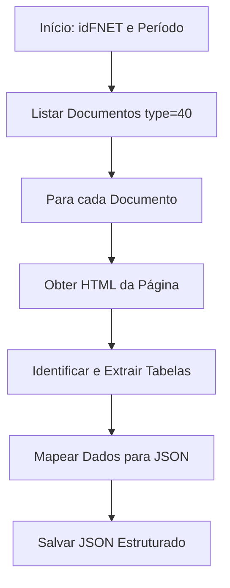

# RFC-002 - Informe Mensal (Estruturado)

---

## 1. Objetivo da funcionalidade

Estender a funcionalidade extratora para capturar e estruturar os dados dos "Informes Mensais Estruturados" de um fundo imobiliario listado na B3. Diferentemente de documentos em PDF, o conteúdo detalhado está disponível em formato **HTML tabular**, o que permite uma extração mais direta e estruturada.

## 2. Fonte de Dados (Listagem de Documentos)

A listagem dos informes mensais utiliza o mesmo endpoint da API da B3, diferenciando-se pelo parâmetro `type` no token da requisição.

**Endpoint:**

```
GET https://sistemaswebb3-listados.b3.com.br/fundsListedProxy/Search/GetStructuredReports/{token}
```

## 3. Parâmetros da Requisição (Decodificados do Token)

O token da URL fornecida, quando decodificado, revela os seguintes parâmetros. A diferença crucial está no campo `"type": 40`.

```json
{
  "linguagem": "pt-br",
  "dataInicial": "2026-01-01",
  "dataFinal": "2026-07-29",
  "pageNumber": 1,
  "pageSize": 20,
  "idFNET": "20294",
  "typeFund": "FII",
  "type": 40
}
```

**Parâmetros para o Token:**
| Parâmetro | Descrição | Valor para Informe Mensal |
| :--- | :--- | :--- |
| `linguagem` | Idioma da resposta. | `"pt-br"` |
| `dataInicial` | Data de início da busca (formato AAAA-MM-DD). | `"2026-01-01"` |
| `dataFinal` | Data de fim da busca (formato AAAA-MM-DD). | `"2026-07-29"` |
| `pageNumber` | Número da página de resultados. | `1` (incrementar para paginação) |
| `pageSize` | Quantidade de registros por página. | `20` |
| **`idFNET`** | **Identificador do fundo (obtido na Etapa 1)**. | `"20294"` (exemplo) |
| `typeFund` | Tipo do fundo. | `"FII"` |
| **`type`** | **Tipo de relatório.** | **`40`** (para Informe Mensal) |

## 4. Estrutura da Resposta (JSON) - Listagem de Documentos

A estrutura da resposta é idêntica à dos rendimentos, alterando apenas o conteúdo.

- **Metadados de Paginação (`page`):** Similar, com `totalRecords` e `totalPages`.
- **Lista de Documentos (`results`):** Um array onde cada item representa um informe mensal.

**Exemplo do JSON de Resposta:**

```json
{
  "page": {
    "pageNumber": 1,
    "pageSize": 20,
    "totalRecords": 6,
    "totalPages": 1
  },
  "results": [
    {
      "urlViewerFundosNet": "https://fnet.bmfbovespa.com.br/fnet/publico/visualizarDocumento?id=1250291",
      "referenceDateFormat": "06/2026",
      "deliveryDateFormat": "15/07/2026 19:48",
      "referenceDate": "2026-06-01T00:00:00-03:00",
      "version": 1,
      "describleType": "Informe Mensal Estruturado",
      "status": "1 (Ativo)"
    }
  ]
}
```

## 5. Mapeamento de Campos para JSON de Saída (Metadados)

Para a etapa de listagem, os metadados dos informes mensais devem ser extraídos e armazenados.

| Campo Fonte (Resposta da API) | Campo Destino (JSON de Saída) | Descrição                            | Exemplo                        |
| :---------------------------- | :---------------------------- | :----------------------------------- | :----------------------------- |
| `urlViewerFundosNet`          | `urlDocumento`                | URL para visualização do documento.  | `"https://fnet...id=1250291"`  |
| `referenceDateFormat`         | `periodoReferencia`           | Mês/ano de referência do informe.    | `"06/2026"`                    |
| `deliveryDateFormat`          | `dataEntrega`                 | Data e hora da entrega do documento. | `"15/07/2026 19:48"`           |
| `referenceDate`               | `dataReferenciaISO`           | Data de referência no formato ISO.   | `"2026-06-01T00:00:00-03:00"`  |
| `version`                     | `versao`                      | Número da versão do documento.       | `1`                            |
| `describleType`               | `tipoRelatorio`               | Tipo do relatório.                   | `"Informe Mensal Estruturado"` |
| `status`                      | `status`                      | Status atual do documento.           | `"1 (Ativo)"`                  |

## 6. Extração do Conteúdo Detalhado (HTML Tabular)

### 6.1. Acesso à Página

A página acessada via `urlViewerFundosNet` (ex: `https://fnet.bmfbovespa.com.br/fnet/publico/exibirDocumento?id=1250291`) contém o conteúdo do informe mensal em formato **HTML tabular**.

### 6.2. Estrutura da Página

A página apresenta dados organizados em tabelas HTML (`<table>`), comuns em informes mensais estruturados da B3. O conteúdo inclui:

- **Cabeçalho do Fundo:** Nome, CNPJ, administrador.
- **Tabela de Composição da Carteira:** Ativos, quantidade, valor de mercado, percentual.
- **Tabela de Resultados:** Rendimentos, despesas, resultado líquido.
- **Indicadores de Performance:** Rentabilidade, patrimônio líquido, valor da cota.
- **Outras Informações:** Prazos, taxas, etc.

### 6.3. Estratégia de Extração

**Passo 1: Obter o HTML da Página**

```python
import requests
from bs4 import BeautifulSoup

url = "https://fnet.bmfbovespa.com.br/fnet/publico/exibirDocumento?id=1250291"
response = requests.get(url)
soup = BeautifulSoup(response.content, 'html.parser')
```

**Passo 2: Identificar e Parsear Tabelas**
O conteúdo tabular está em tabelas HTML. Cada tabela pode ser identificada por seu cabeçalho ou posição.

```python
# Encontrar todas as tabelas na página
tables = soup.find_all('table')

# Ou, se houver uma tabela específica com um ID ou classe
tabela_carteira = soup.find('table', {'class': 'carteira'})  # Ajustar seletor conforme necessário
```

**Passo 3: Extrair Dados de Cada Tabela**
Para cada tabela, extrair cabeçalhos e linhas:

```python
def extrair_tabela(table):
    """Extrai dados de uma tabela HTML para um dicionário estruturado"""
    dados = []

    # Extrair cabeçalhos
    headers = []
    thead = table.find('thead')
    if thead:
        headers = [th.get_text(strip=True) for th in thead.find_all('th')]

    # Extrair linhas
    tbody = table.find('tbody') or table
    for row in tbody.find_all('tr'):
        cols = row.find_all('td')
        if not headers and cols:
            # Usar a primeira linha como cabeçalho se não houver thead
            headers = [col.get_text(strip=True) for col in cols]
            continue

        row_data = {}
        for idx, col in enumerate(cols):
            if idx < len(headers):
                row_data[headers[idx]] = col.get_text(strip=True)
        if row_data:
            dados.append(row_data)

    return dados
```

**Passo 4: Identificar o Contexto de Cada Tabela**
Cada tabela tem um contexto que pode ser identificado por um título ou texto próximo:

```python
def identificar_contexto_tabela(soup, table):
    """Identifica o contexto da tabela baseado em elementos próximos"""
    # Procura por um cabeçalho (<h2>, <h3>) ou texto em negrito antes da tabela
    previous = table.find_previous(['h2', 'h3', 'h4', 'strong', 'b'])
    if previous:
        return previous.get_text(strip=True)

    # Fallback: usar o texto do caption, se existir
    caption = table.find('caption')
    if caption:
        return caption.get_text(strip=True)

    return "Informações Gerais"
```

### 6.4. Mapeamento para JSON Estruturado

Com base nas tabelas extraídas, o JSON final deve ter uma estrutura que reflita a organização do informe mensal:

```json
{
  "idDocumento": "1250291",
  "urlDocumento": "https://fnet.bmfbovespa.com.br/fnet/publico/visualizarDocumento?id=1250291",
  "periodoReferencia": "06/2026",
  "dataEntrega": "15/07/2026 19:48",
  "dataExtracao": "2026-07-29T14:30:00-03:00",
  "dadosFundos": {
    "nomeFundo": "ALIANZA TRUST RENDA IMOBILIÁRIA - FUNDO DE INVESTIMENTO IMOBILIÁRIO RESPONSABILIDADE LIMITADA",
    "cnpjFundo": "28.737.771/0001-85"
  },
  "dadosAdministrador": {
    "nomeAdministrador": "BTG PACTUAL SERVIÇOS FINANCEIROS S/A DTVM",
    "cnpjAdministrador": "59.281.253/0001-23"
  },
  "carteira": {
    "tabela": [
      {
        "ativo": "Tesouro Selic",
        "quantidade": 10000,
        "valorMercado": 1050000.0,
        "percentual": 12.5
      }
    ],
    "totalAtivos": 8400000.0,
    "totalPassivos": 1200000.0,
    "patrimonioLiquido": 7200000.0
  },
  "resultados": {
    "receitas": {
      "rendimentos": 850000.0,
      "outrasReceitas": 25000.0
    },
    "despesas": {
      "administracao": 45000.0,
      "auditoria": 12000.0,
      "outrasDespesas": 18000.0
    },
    "resultadoLiquido": 800000.0
  },
  "indicadores": {
    "rentabilidadeMes": 1.25,
    "rentabilidadeAno": 8.5,
    "valorCota": 98.5,
    "patrimonioLiquido": 7200000.0,
    "numCotistas": 12500
  },
  "outrasInformacoes": {
    "taxaAdministracao": 0.5,
    "prazo": "Indeterminado",
    "categoriaAnbima": "Renda"
  }
}
```

### 6.5. Tratamento de Dados Específicos

**Valores Monetários:**

- Remover "R$" e outros caracteres.
- Converter vírgula decimal para ponto.
- Converter para float.

```python
def limpar_valor_monetario(valor):
    """Converte string de valor monetário para float"""
    if not valor:
        return None
    # Remove "R$", espaços e substitui vírgula por ponto
    valor_limpo = valor.replace('R$', '').replace('.', '').replace(',', '.').strip()
    try:
        return float(valor_limpo)
    except ValueError:
        return None
```

**Percentuais:**

- Remover "%".
- Converter para float (ex: "12,50%" → 12.50).

**Datas:**

- Converter para formato ISO (`AAAA-MM-DD`) quando aplicável.

**Números:**

- Remover pontos de milhar.
- Converter para int ou float.

## 7. Fluxo de Trabalho para Codificação



## 8. Resumo para Codificação

Para implementar a captura dos informes mensais, você precisará:

1.  **Adicionar uma Constante:** Definir `TIPO_RELATORIO_INFORME_MENSAL = 40`.
2.  **Reutilizar a Lógica de Listagem:** A função `listar_documentos( idFNET, data_inicio, data_fim, tipo_relatorio )` deve aceitar o parâmetro `tipo_relatorio` para construir o token adequado.
3.  **Implementar Extrator HTML Tabular:** Criar um módulo que:
    - Baixe o HTML da página.
    - Parseie as tabelas com BeautifulSoup.
    - Identifique o contexto de cada tabela.
    - Extraia e limpe os dados.
4.  **Estruturar o JSON de Saída:** Mapear os dados extraídos para a estrutura JSON definida.
5.  **Ajustar a Estrutura de Saída:** O JSON final deve ter um campo `tipoRelatorio` para diferenciar os dados (ex: "Informe Mensal").
6.  **Tratamento de Erros:** Implementar fallbacks para páginas com estrutura diferente ou dados ausentes.

## 9. Considerações Finais

- **Simplicidade:** Preferir bibliotecas nativas a dependencias externas. Usar dependencias externas somente quando estritamente necessário.
- **Segurança:** Só usar dependencias externas que sejam amplamente testadas e aceitas no mercado. Nada de dependencias pouco usadas ou desconhecidas.
- **Flexibilidade:** A estrutura HTML pode variar entre fundos ou períodos. Implemente seletores flexíveis e verificações de existência de elementos.
- **Validação:** Validar os dados extraídos (ex: total de ativos = soma dos ativos) para detectar inconsistências.
- **Logging:** Registrar todas as etapas, especialmente falhas de parsing ou dados não encontrados.
- **Evolução:** Esta abordagem pode ser estendida para outros tipos de relatórios estruturados que utilizem tabelas HTML.
