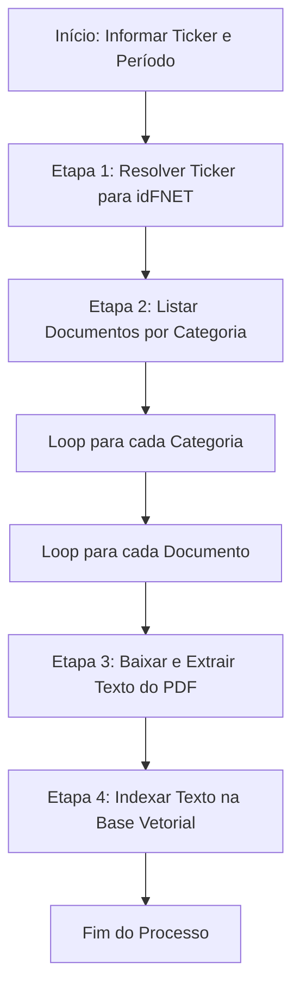

# RFC-003 - Informações relevantes (não estruturado)

---

## Extração e Indexação Vetorial de Documentos Relevantes

### 1. Objetivo da funcionalidade
Desenvolver uma funcionalidade para:
1. Capturar listagens de documentos de "Informações Relevantes" (Assembleias, Comunicados, Fatos Relevantes e Relatórios) de Fundos de Investimento Imobiliário (FIIs).
2. Baixar os arquivos PDF associados a cada documento.
3. Extrair o texto completo de cada PDF.
4. Indexar os textos extraídos em uma base vetorial local (Chroma, FAISS ou SQLite-VSS) para consultas semânticas via RAG (Retrieval-Augmented Generation).

### 2. Arquitetura Geral da funcionalidade



### 3. Etapa 1: Resolução do Ticker para idFNET

**Endpoint:**
```
GET https://sistemaswebb3-listados.b3.com.br/fundsListedProxy/Search/GetListClassFund/{token}
```

**Parâmetros do Token:**
| Parâmetro | Descrição | Valor (Exemplo) |
| :--- | :--- | :--- |
| `linguagem` | Idioma da resposta | `"pt-br"` |
| `idCEM` | Ticker do fundo (sem o sufixo "11") | `"ALZR"` |
| `typeFund` | Tipo do fundo | `"FII"` |

**Processamento da Resposta:**
A resposta é um array JSON. O `idFNET` é o `id` do objeto onde `tradingName` **NÃO** contém `"Fundo:"`.

**Exemplo:**
```json
// Resposta para "ALZR"
[
  {"id":"870", "tradingName":"Fundo: 28.737.771/0001-85"},
  {"id":"20294", "tradingName":"28.737.771/0001-85"} // <-- idFNET = "20294"
]
```

### 4. Etapa 2: Listagem de Documentos por Categoria

**Endpoint:**
```
GET https://sistemaswebb3-listados.b3.com.br/fundsListedProxy/Search/GetReportsRelevants/{token}
```

**Parâmetros do Token:**
| Parâmetro | Descrição | Valor (Exemplo) |
| :--- | :--- | :--- |
| `linguagem` | Idioma da resposta | `"pt-br"` |
| `pageNumber` | Número da página | `1` |
| `pageSize` | Itens por página | `20` |
| `dataInicial` | Data de início da busca | `"2026-01-01"` |
| `dataFinal` | Data de fim da busca | `"2026-07-29"` |
| `idFNET` | Identificador do fundo | `"20294"` |
| `typeFund` | Tipo do fundo | `"FII"` |
| **`category`** | **Categoria do documento** | Ver tabela abaixo |

**Mapeamento de Categorias:**
| Categoria | Valor `category` | Descrição |
| :--- | :--- | :--- |
| Assembleias | `2` | Documentos relacionados a assembleias de cotistas |
| Comunicado ao mercado | `3` | Comunicados oficiais ao mercado |
| Fato relevante | `1` | Fatos relevantes do fundo |
| Relatórios | `7` | Relatórios diversos (gerenciais, anuais, etc.) |

**Estrutura da Resposta:**
```json
{
  "page": {
    "pageNumber": 1,
    "pageSize": 20,
    "totalRecords": 5,
    "totalPages": 1
  },
  "results": [
    {
      "urlViewerFundosNet": "https://fnet.bmfbovespa.com.br/fnet/publico/visualizarDocumento?id=1252542",
      "description": "Ata de Assembleia Geral Ordinária",
      "referenceDate": "2026-07-17T00:00:00-03:00",
      "deliveryDate": "2026-07-17T17:18:00-03:00",
      "type": "1",  // Tipo do documento
      "category": "2" // Categoria (já conhecida)
    }
  ]
}
```

**Mapeamento de Campos:**
| Campo Fonte | Campo Destino | Descrição |
| :--- | :--- | :--- |
| `urlViewerFundosNet` | `urlDocumento` | URL para visualização (contém o `id`) |
| `description` | `descricao` | Descrição/título do documento |
| `referenceDate` | `dataReferencia` | Data de referência |
| `deliveryDate` | `dataEntrega` | Data de entrega do documento |
| `type` | `tipoDocumento` | Tipo específico do documento |
| `category` | `categoria` | Categoria do documento |

**Tratamento de Paginação:**
- Extrair `page.totalPages`.
- Se `totalPages > 1`, iterar, alterando `pageNumber` no token.
- Consolidar todos os `results` em uma única lista.

### 5. Etapa 3: Download e Extração de Texto do PDF

**Processamento do Documento:**
1. **Extrair ID do Documento:**
   ```python
   url = "https://fnet.bmfbovespa.com.br/fnet/publico/visualizarDocumento?id=1252542"
   doc_id = url.split("id=")[-1]  # "1252542"
   ```

2. **Construir URL de Download:**
   ```
   https://fnet.bmfbovespa.com.br/fnet/publico/exibirDocumento?id={doc_id}
   ```

3. **Baixar o PDF:**
   ```python
   import requests
   response = requests.get(download_url, stream=True)
   pdf_content = response.content
   ```

4. **Extrair Texto do PDF:**
   ```python
   import io
   import PyPDF2
   
   pdf_file = io.BytesIO(pdf_content)
   pdf_reader = PyPDF2.PdfReader(pdf_file)
   texto_completo = ""
   for page in pdf_reader.pages:
       texto_completo += page.extract_text()
   ```

**Alternativa com pdfplumber (mais robusto):**
```python
import pdfplumber

with pdfplumber.open(io.BytesIO(pdf_content)) as pdf:
    texto_completo = "".join(page.extract_text() for page in pdf.pages)
```

**Tratamento de Erros:**
- Verificar se o conteúdo baixado é realmente um PDF.
- Implementar timeout (ex: 60 segundos).
- Retry em caso de falha (ex: 3 tentativas).
- Logar documentos que falharam na extração.

**Metadados do Documento:**
| Campo | Descrição |
| :--- | :--- |
| `idDocumento` | ID único do documento |
| `categoria` | Categoria do documento |
| `descricao` | Título/descrição do documento |
| `dataReferencia` | Data de referência |
| `dataEntrega` | Data de entrega |
| `urlDocumento` | URL original do documento |
| `textoExtraido` | Texto completo extraído do PDF |
| `tamanhoBytes` | Tamanho do PDF em bytes |
| `dataExtracao` | Data e hora da extração |

### 6. Etapa 4: Indexação Vetorial dos Textos

**Opções de Base Vetorial Local:**

| Ferramenta | Vantagens | Desvantagens |
| :--- | :--- | :--- |
| **Chroma** | - API simples e intuitiva<br>- Persistência local fácil<br>- Suporte a filtros por metadados | - Dependente de DuckDB |
| **FAISS** | - Alta performance<br>- Leve e rápido<br>- Ampla documentação | - API de nível mais baixo<br>- Requer mais código para metadados |
| **SQLite-VSS** | - Integração nativa com SQLite<br>- Fácil de gerenciar<br>- SQL para consultas | - Menos maduro que FAISS e Chroma |

**Recomendação: Chroma** (melhor equilíbrio entre facilidade de uso e funcionalidades)

**Estrutura da Coleção:**
```python
import chromadb
from chromadb.utils import embedding_functions

# Inicializar cliente
client = chromadb.PersistentClient(path="./db_fii_docs")

# Configurar modelo de embeddings (usando sentence-transformers local)
embedding_fn = embedding_functions.SentenceTransformerEmbeddingFunction(
    model_name="all-MiniLM-L6-v2"  # Modelo leve e eficaz
)

# Criar ou obter coleção
collection = client.get_or_create_collection(
    name="documentos_relevantes",
    embedding_function=embedding_fn,
    metadata={"hnsw:space": "cosine"}  # Similaridade por cosseno
)
```

**Estrutura dos Metadados:**
Para cada documento, os metadados armazenados devem incluir:

```python
metadata = {
    "id_fnet": "20294",
    "ticker": "ALZR11",
    "categoria": "Assembleias",  # ou "Comunicado", "Fato Relevante", "Relatorios"
    "id_documento": "1252542",
    "descricao": "Ata de Assembleia Geral Ordinária",
    "data_referencia": "2026-07-17",
    "data_entrega": "2026-07-17 17:18",
    "url": "https://fnet.bmfbovespa.com.br/fnet/publico/visualizarDocumento?id=1252542",
    "tamanho_bytes": 245760,
    "data_extracao": "2026-07-29T14:30:00"
}
```

**Inserção na Base Vetorial:**
```python
# Dividir texto longo em chunks (opcional, mas recomendado)
def chunk_text(text, chunk_size=1000, overlap=200):
    # Implementar chunking com overlap
    pass

# Inserir documentos
collection.add(
    documents=[texto_completo],  # ou lista de chunks
    metadatas=[metadata],
    ids=[f"doc_{doc_id}"]  # ID único para cada documento
)
```

**Otimização com Chunking:**
Para documentos longos, recomenda-se dividir o texto em chunks com overlap:

```python
from langchain.text_splitter import RecursiveCharacterTextSplitter

text_splitter = RecursiveCharacterTextSplitter(
    chunk_size=1000,
    chunk_overlap=200,
    separators=["\n\n", "\n", ".", " ", ""]
)

chunks = text_splitter.split_text(texto_completo)
for i, chunk in enumerate(chunks):
    collection.add(
        documents=[chunk],
        metadatas=[{**metadata, "chunk_index": i}],
        ids=[f"doc_{doc_id}_chunk_{i}"]
    )
```

### 7. Exemplo de Fluxo de Trabalho (Python)

```python
import json
import requests
import base64
import PyPDF2
import io
import chromadb
from datetime import datetime
from typing import List, Dict

class ExtratorDocumentosRelevantes:
    def __init__(self, ticker: str):
        self.ticker = ticker
        self.id_fnet = self._resolver_ticker()
        self.categorias = {
            "assembleias": 2,
            "comunicados": 3,
            "fatos_relevantes": 1,
            "relatorios": 7
        }
        self.client = chromadb.PersistentClient(path="./db_fii_docs")
        self.collection = self.client.get_or_create_collection(
            name="documentos_relevantes",
            embedding_function=embedding_functions.SentenceTransformerEmbeddingFunction(
                model_name="all-MiniLM-L6-v2"
            )
        )
    
    def _resolver_ticker(self) -> str:
        # Implementar Etapa 1
        pass
    
    def listar_documentos(self, categoria: str, data_inicio: str, data_fim: str) -> List[Dict]:
        # Implementar Etapa 2
        pass
    
    def baixar_e_extrair_pdf(self, url: str) -> str:
        # Implementar Etapa 3
        pass
    
    def indexar_documento(self, texto: str, metadados: Dict):
        # Implementar Etapa 4
        pass
    
    def executar_extracao(self, data_inicio: str, data_fim: str):
        for nome, cat_id in self.categorias.items():
            documentos = self.listar_documentos(cat_id, data_inicio, data_fim)
            for doc in documentos:
                try:
                    texto = self.baixar_e_extrair_pdf(doc['url'])
                    metadados = {
                        "ticker": self.ticker,
                        "id_fnet": self.id_fnet,
                        "categoria": nome,
                        "id_documento": doc['id'],
                        "descricao": doc['descricao'],
                        "data_referencia": doc['data_referencia'],
                        "data_entrega": doc['data_entrega'],
                        "url": doc['url']
                    }
                    self.indexar_documento(texto, metadados)
                except Exception as e:
                    print(f"Erro ao processar {doc['id']}: {e}")
```

### 8. Consultas RAG

Após a indexação, consultas podem ser realizadas:

```python
def consultar_rag(query: str, categoria: str = None, top_k: int = 5):
    where_filter = {"categoria": categoria} if categoria else None
    
    results = collection.query(
        query_texts=[query],
        n_results=top_k,
        where=where_filter
    )
    
    return results

# Exemplo de uso
resultados = consultar_rag("divisão de rendimentos do fundo", categoria="Assembleias")
```

### 9. Tratamento de Erros e Considerações

1. **Validação de PDF:** Verificar se o conteúdo baixado é realmente um PDF (`%PDF` no início do arquivo).
2. **Imagens em PDFs:** Deverão ser ignorados (nada de OCR). Apenas texto deverá ser extraído dos arquivos.
3. **Memory Management:** Para coleções grandes, considerar processamento em lote.
4. **Backup:** Manter backup da base vetorial local regularmente.
5. **Atualização:** Implementar lógica para não reindexar documentos já processados (verificar por `id_documento`).
6. **Monitoramento:** Loggar métricas como: total de documentos, sucesso/falha, tempo de processamento.

### 10. Requisitos de Instalação (sugestão)

```bash
# Dependências principais (sugestão)
pip install requests chromadb sentence-transformers PyPDF2 pdfplumber
pip install langchain  # Para chunking avançado (opcional)
```
## 11. Considerações Finais

- **Simplicidade:** Preferir bibliotecas nativas a dependencias externas. Usar dependencias externas somente quando estritamente necessário.
- **Segurança:** Só usar dependencias externas que sejam amplamente testadas e aceitas no mercado. Nada de dependencias pouco usadas ou desconhecidas.
- **Logging:** Registrar todas as etapas, especialmente falhas de parsing ou dados não encontrados.
- **Evolução:** Esta abordagem pode ser estendida para outros tipos de relatórios não estruturados que utilizem arquivos PDF.
