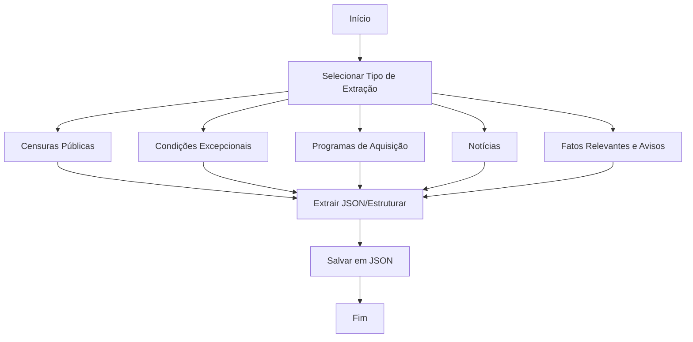

# RFC-004 - Informações Regulatórias e de Mercado da B3

---

## 1. Objetivo da Funcionalidade

Desenvolver uma funcionalidade para extrair, processar e estruturar informações regulatórias e de mercado disponibilizadas pela B3, abrangendo:

1. **Censuras Públicas** - Penalidades aplicadas a emissores.
2. **Condições Excepcionais** - Dispensas temporárias de regras.
3. **Programas de Aquisição de Ações** - Programas em andamento.
4. **Notícias** - Plantão de notícias da B3.
5. **Fatos Relevantes** - Comunicados oficiais.
6. **Avisos** - Avisos a acionistas e debenturistas.
7. **Assembleias** - Documentos e atas de assembleias.

---

## 2. Arquitetura Geral



---

## 3. Descrição Detalhada das Fontes e Extração

### 3.1. Censuras Públicas

**Fonte:** Página HTML estática

```
https://www.b3.com.br/pt_br/regulacao/regulacao-de-emissores/censuras-publicas/
```

**Estrutura da Página:**
A página contém uma lista de censuras com a seguinte estrutura:

- **Título:** Nome do emissor e ticker (ex: "FII TORDE EI (TORD)")
- **Data:** Data da aplicação da censura (ex: "(25/02/2026)")
- **Conteúdo:** Texto descritivo da infração e penalidade

**Estratégia de Extração:**

```python
from bs4 import BeautifulSoup
import re

def extrair_censuras():
    response = requests.get("https://www.b3.com.br/pt_br/regulacao/regulacao-de-emissores/censuras-publicas/")
    soup = BeautifulSoup(response.content, 'html.parser')

    censuras = []
    # Identificar blocos de censura no HTML
    blocos = soup.find_all('div', class_='item-censura')  # Ajustar seletor

    for bloco in blocos:
        # Extrair título e ticker
        titulo = bloco.find('h3').get_text(strip=True)
        ticker_match = re.search(r'\(([A-Z0-9]+)\)', titulo)
        ticker = ticker_match.group(1) if ticker_match else None

        # Extrair data
        data_texto = bloco.find('span', class_='data').get_text(strip=True)
        data_match = re.search(r'\((\d{2}/\d{2}/\d{4})\)', data_texto)
        data = data_match.group(1) if data_match else None

        # Extrair conteúdo
        conteudo = bloco.find('p').get_text(strip=True)

        censuras.append({
            "titulo": titulo,
            "ticker": ticker,
            "data": data,
            "conteudo": conteudo
        })

    return censuras
```

**Estrutura do JSON:**

```json
{
  "tipo": "censuras_publicas",
  "dataExtracao": "2026-07-29T14:30:00-03:00",
  "censuras": [
    {
      "titulo": "FII TORDE EI (TORD)",
      "ticker": "TORD",
      "data": "25/02/2026",
      "conteudo": "A B3 S.A. – Brasil, Bolsa, Balcão vem a público censurar a VÓRTX DISTRIBUIDORA DE TITULOS E VALORES MOBILIARIOS LTDA..."
    }
  ]
}
```

### 3.2. Condições Excepcionais

**Fonte:** Página HTML estática

```
https://www.b3.com.br/pt_br/regulacao/regulacao-de-emissores/condicoes-excepcionais/
```

**Estrutura da Página:**
A página contém uma tabela com as seguintes colunas:

- Companhia
- Segmento
- Condição Excepcional
- Data da concessão
- Prazo para cumprimento

**Estratégia de Extração:**

```python
def extrair_condicoes_excepcionais():
    response = requests.get("https://www.b3.com.br/pt_br/regulacao/regulacao-de-emissores/condicoes-excepcionais/")
    soup = BeautifulSoup(response.content, 'html.parser')

    condicoes = []
    tabela = soup.find('table')

    for row in tabela.find_all('tr')[1:]:  # Pular cabeçalho
        cols = row.find_all('td')
        if len(cols) >= 5:
            condicoes.append({
                "companhia": cols[0].get_text(strip=True),
                "segmento": cols[1].get_text(strip=True),
                "condicao": cols[2].get_text(strip=True),
                "dataConcessao": cols[3].get_text(strip=True),
                "prazo": cols[4].get_text(strip=True)
            })

    return condicoes
```

**Estrutura do JSON:**

```json
{
  "tipo": "condicoes_excepcionais",
  "dataExtracao": "2026-07-29T14:30:00-03:00",
  "condicoes": [
    {
      "companhia": "Bradsaúde S.A.",
      "segmento": "Novo Mercado",
      "condicao": "Percentual Mínimo de Ações em Circulação abaixo do requerido (8,609%)",
      "dataConcessao": "19/05/2026",
      "prazo": "30/10/2027"
    }
  ]
}
```

### 3.3. Programas de Aquisição de Ações

**Fonte:** Página HTML estática

```
https://www.b3.com.br/pt_br/produtos-e-servicos/negociacao/renda-variavel/acoes/consultas/programa-de-aquisicao-de-acoes-em-andamento/
```

**Observação:** Esta página requer análise mais aprofundada da estrutura HTML para extração dos programas em andamento.

### 3.4. Notícias

**Fonte:** API JSON

```
https://sistemasweb.b3.com.br/PlantaoNoticias/Noticias/ListarTitulosNoticias?agencia=18&palavra=&dataInicial=2026-07-27&dataFinal=2026-07-29
```

**Parâmetros da Requisição:**
| Parâmetro | Descrição | Valor (Exemplo) |
| :--- | :--- | :--- |
| `agencia` | Código da agência | `18` (B3) |
| `palavra` | Palavra de busca | (opcional) |
| `dataInicial` | Data de início | `2026-07-27` |
| `dataFinal` | Data de fim | `2026-07-29` |

**Resposta Esperada:** Lista de títulos de notícias com links para detalhes.

### 3.5. Fatos Relevantes, Avisos e Assembleias

**Fonte:** API JSON via endpoint unificado

```
https://sistemaswebb3-listados.b3.com.br/listedCompaniesProxy/CompanyCall/GetMaterialFacts/{token}
```

**Construção do Token:**
O token é uma string Base64 codificada a partir de um objeto JSON:

```json
{
  "linguagem": "pt-br",
  "codeCVM": "9512",
  "year": 2026,
  "dataInicial": "2026-01-01",
  "dataFinal": "2026-12-31",
  "categoria": "1",
  "pageNumber": 1,
  "pageSize": 5
}
```

**Mapeamento de Categorias:**
| Categoria | Valor `categoria` | Descrição |
| :--- | :--- | :--- |
| Assembleias | `1` | Documentos de assembleias |
| Aviso aos Acionistas | `3` | Avisos a acionistas |
| Fatos Relevantes | `4` | Fatos relevantes |
| Aviso aos Debenturistas | `48` | Avisos a debenturistas |
| Relatório de Proventos | `107` | Relatórios de proventos |

**Estrutura da Resposta:**

```json
{
  "page": {
    "pageNumber": 1,
    "pageSize": 5,
    "totalRecords": 16,
    "totalPages": 4
  },
  "results": [
    {
      "company": {
        "codeCVM": "009512",
        "companyName": "PETROLEO BRASILEIRO S.A. PETROBRAS",
        "tradingName": "PETROBRAS"
      },
      "dateReference": "16/04/2026 14:16",
      "delivery": "Apresentação",
      "deliveryDate": "28/04/2026 19:19:42",
      "status": "Ativo",
      "category": "Assembleia",
      "type": "AGO",
      "kind": "Ata",
      "version": "1",
      "subject": "Tomada de Contas-Votação...",
      "urlSearch": "https://www.rad.cvm.gov.br/ENETWEB/frmExibirArquivoIPEExterno.aspx?ID=1510187",
      "urlDownload": "https://www.rad.cvm.gov.br/ENET/frmDownloadDocumento.aspx?Tela=ext&numSequencia=1034893&numVersao=1&numProtocolo=1510187&descTipo=IPE&CodigoInstituicao=1"
    }
  ]
}
```

## 4. Estrutura do JSON de Saída Consolidado

### 4.1. Fatos Relevantes e Avisos

```json
{
  "tipo": "fatos_relevantes",
  "categoria": "Assembleia",
  "dataExtracao": "2026-07-29T14:30:00-03:00",
  "metadados": {
    "codeCVM": "9512",
    "empresa": "PETROLEO BRASILEIRO S.A. PETROBRAS",
    "ticker": "PETR4"
  },
  "documentos": [
    {
      "id": "1510187",
      "dataReferencia": "2026-04-16T14:16:00",
      "dataEntrega": "2026-04-28T19:19:42",
      "tipo": "AGO",
      "categoria": "Assembleia",
      "especie": "Ata",
      "versao": "1",
      "status": "Ativo",
      "assunto": "Tomada de Contas-Votação do Relatório da Administração...",
      "urlDocumento": "https://www.rad.cvm.gov.br/ENETWEB/frmExibirArquivoIPEExterno.aspx?ID=1510187",
      "urlDownload": "https://www.rad.cvm.gov.br/ENET/frmDownloadDocumento.aspx?Tela=ext&numSequencia=1034893&numVersao=1&numProtocolo=1510187&descTipo=IPE&CodigoInstituicao=1"
    }
  ]
}
```

### 4.2. Fluxo Completo para Extração de Fatos Relevantes

```python
def extrair_material_facts(code_cvm, categoria, data_inicio, data_fim):
    """
    Extrai documentos de uma categoria específica.

    Args:
        code_cvm: Código CVM da empresa
        categoria: Código da categoria (1, 3, 4, 48, 107)
        data_inicio: Data de início (AAAA-MM-DD)
        data_fim: Data de fim (AAAA-MM-DD)
    """
    payload = {
        "linguagem": "pt-br",
        "codeCVM": code_cvm,
        "year": 2026,
        "dataInicial": data_inicio,
        "dataFinal": data_fim,
        "categoria": str(categoria),
        "pageNumber": 1,
        "pageSize": 20
    }

    token = base64.b64encode(json.dumps(payload).encode()).decode()
    url = f"https://sistemaswebb3-listados.b3.com.br/listedCompaniesProxy/CompanyCall/GetMaterialFacts/{token}"

    response = requests.get(url)
    data = response.json()

    # Tratar paginação
    todos_resultados = data['results']
    total_paginas = data['page']['totalPages']

    for pagina in range(2, total_paginas + 1):
        payload['pageNumber'] = pagina
        token = base64.b64encode(json.dumps(payload).encode()).decode()
        url = f"https://.../GetMaterialFacts/{token}"
        response = requests.get(url)
        data_pagina = response.json()
        todos_resultados.extend(data_pagina['results'])

    return todos_resultados
```

---

## 5. Considerações Finais

### 5.1. Padrões de Extração

| Fonte                  | Tipo | Endpoint        | Autenticação |
| :--------------------- | :--- | :-------------- | :----------- |
| Censuras Públicas      | HTML | Página estática | Não          |
| Condições Excepcionais | HTML | Página estática | Não          |
| Programas de Aquisição | HTML | Página estática | Não          |
| Notícias               | JSON | API pública     | Não          |
| Fatos Relevantes       | JSON | API pública     | Não (token)  |

### 5.2. Recomendações

1. **Fatos Relevantes:** Mapear todas as categorias disponíveis.
2. **Paginação:** Implementar lógica de paginação para todos os endpoints.
3. **Metadados:** Extrair e armazenar metadados de cada documento.
4. **Downloads:** Os `urlDownload` apontam para PDFs que podem ser baixados e processados.
5. **Categorias:** Manter um mapeamento atualizado das categorias disponíveis.

### 5.3. Dependências (sugestão)

```bash
pip install requests beautifulsoup4 pandas
```
